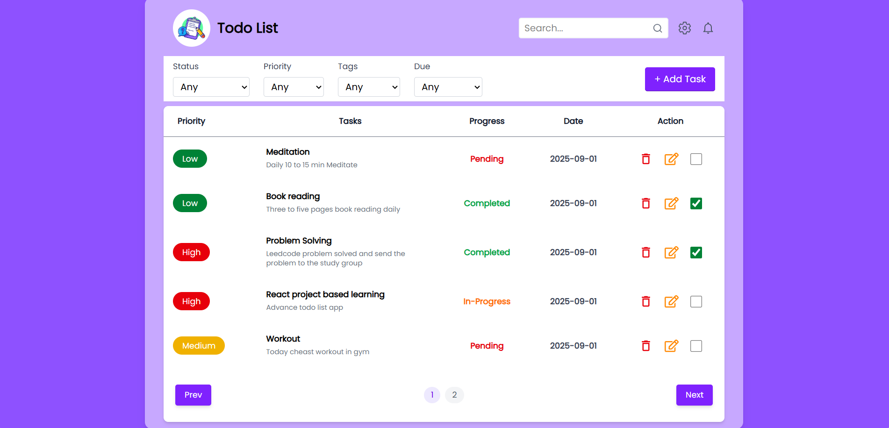

📝 Todo App (React + Redux Toolkit + TypeScript)

A simple Todo Application built with React, Redux Toolkit, TypeScript, and JSON Server for local API simulation.
This project demonstrates state management, async thunks, CRUD operations, and containerization with Docker.

🚀 Features

➕ Add a new Todo task

✏️ Edit/Update existing Todos

🗑️ Delete Todos

✅ Mark tasks as Pending, In Progress, or Completed

🔍 Filter/Manage todos by priority (Low, Medium, High)

📅 Add due date for tasks

🌐 Local backend powered by JSON Server

🐳 Dockerized for easy deployment

📸 Demo

Place your project screenshot in the public/ folder and rename it:

📂 Project Structure
todo/
│── data/ # Local database for JSON Server
│ └── todoItem.json
│
│── dist/ # Production build (auto-generated)
│── node_modules/ # Dependencies (auto-generated)
│── public/ # Static assets (images, favicon, screenshot)
│
│── src/ # Application source code
│ ├── api/ # API service functions
│ │ └── todoApi.ts
│ │
│ ├── features/ # Redux logic
│ │ └── todos/
│ │ ├── todosSlice.ts
│ │ ├── todosThunks.ts
│ │ └── todosTypes.ts
│ │
│ ├── components/ # UI Components
│ │ ├── AddTodo.tsx
│ │ ├── TodoList.tsx
│ │ └── TodoItem.tsx
│ │
│ ├── store.ts # Redux store configuration
│ ├── App.tsx # Root component
│ └── main.tsx # Entry point
│
│── .dockerignore
│── .gitignore
│── Dockerfile
│── eslint.config.js
│── index.html
│── nginx.conf
│── package-lock.json
│── package.json
│── README.md
│── tsconfig.app.json
│── tsconfig.json
│── tsconfig.node.json
│── vite.config.ts

🛠️ Tech Stack

⚛️ React 18 – UI library

🧰 Redux Toolkit – State management

🟦 TypeScript – Type safety

⚡ Vite – Fast build tool

📦 JSON Server – Mock REST API

🐳 Docker + Nginx – Containerized production deployment

📦 Installation & Setup
1️⃣ Clone the repository
git clone https://github.com/dhashnamoorthipalanivel/todo
cd todo-app

2️⃣ Install dependencies
npm install

3️⃣ Run JSON Server (Local Backend)
npx json-server --watch data/todoItem.json --port 3000 --static ./data

JSON Server API Endpoints:

Method Endpoint Description
GET /todos Fetch all todos
POST /todos Add new todo
PUT /todos/:id Update todo
DELETE /todos/:id Delete todo

Runs at: http://localhost:3000/todos

4️⃣ Start the React app
npm run dev

React app runs at: http://localhost:5173

📌 Example Todo Object
{
"id": "1",
"task": "Complete Redux Toolkit setup",
"priority": "High",
"description": "Integrate Redux store and slices",
"progress": "Pending",
"date": "2025-09-16"
}

🐳 Docker Setup

Dockerfile (already included):

# ---------- build stage ----------

FROM node:18-alpine AS build
WORKDIR /app

COPY package\*.json ./
RUN npm ci --no-audit --prefer-offline

COPY . .
RUN npm run build

# ---------- production stage ----------

FROM nginx:stable-alpine
RUN rm -rf /usr/share/nginx/html/\*
COPY --from=build /app/dist /usr/share/nginx/html
COPY nginx.conf /etc/nginx/conf.d/default.conf

EXPOSE 80
CMD ["nginx", "-g", "daemon off;"]

Build and Run Docker Container

# Build Docker image

docker build -t todo-app .

# Run Docker container

docker run -p 8080:80 todo-app

Access app via: http://localhost:8080

🤝 Contributing

Fork this repo

Create your feature branch (git checkout -b feature-name)

Commit your changes (git commit -m "Add new feature")

Push to the branch (git push origin feature-name)

Open a Pull Request

📜 License

This project is licensed under the MIT License.
